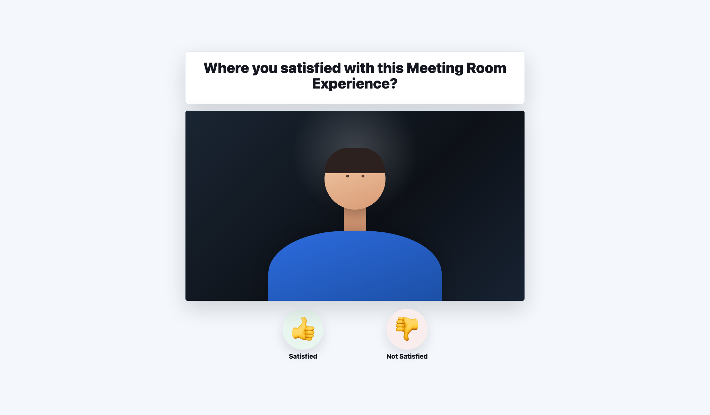
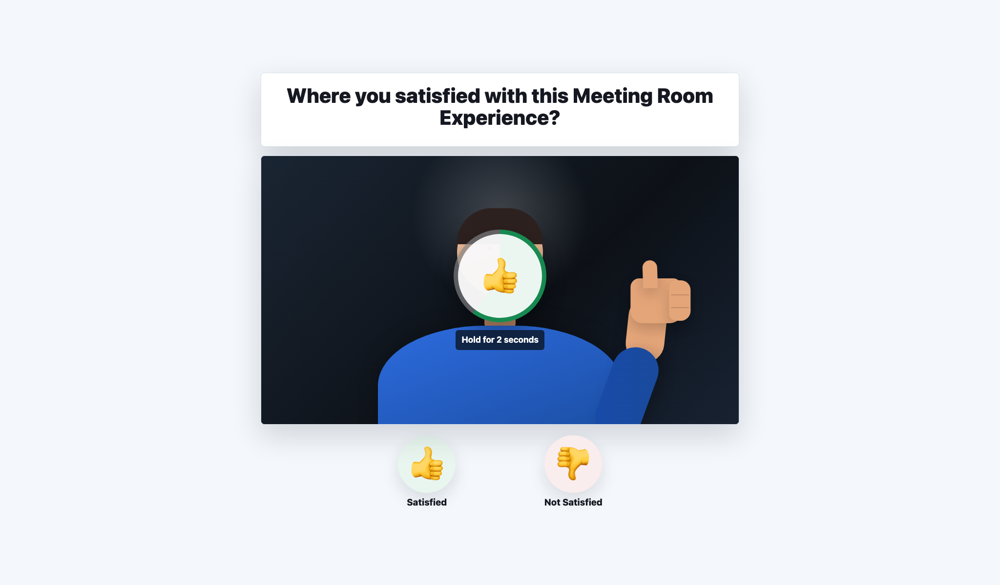
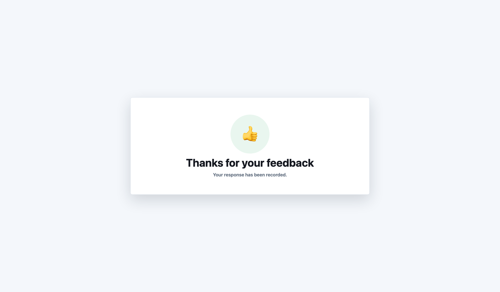

# BYOD Feedback Web App

This is an example web app shows how to collect meeting room feedback from Cisco BYOD collaboration spaces where a Touch Controller isn't available by using thumbs up 👍 and down 👎 guestures.



## Overview

The solution consists of two parts:

### Post Meeting Macro:

The [byod-feedback](macro/byod-feedback.js) post meeting macro launches the feedback web app after a meeting or BYOD session disconnects, allowing users to give feedback directly from the room display. The macro appends workspace and meeting details to the web apps url as hash parameters which are JSON Base64 encode

By default, the macro will share the follow details

- `workspaceName` - eg: "Meeting Room 1"
- `meetingType` - eg: "BYOD" or "Webex"
- `duration` - duration of meeting in minutes
- `feedbackUrl` - where the the web app should post the collected feedback

### Static Web App:

Upon opening web app accesses the Cisco Devices web camera and processes the video captured of the room though a [MediaPipe Gesture Recognizer](https://ai.google.dev/edge/mediapipe/solutions/vision/gesture_recognizer). No video capture leaves the devices, and captured video is processed in the browser on the Cisco Device.

#### Hold Guesture Countdown:

When the user is detected as guesturing a thumbs up or thumbs down, a countdown is shown for a set time until the guesture is accepted.



#### Feedback Captured Success:

Once the feedback is captured, the web app then showss a success screen. In the background, the collected feedback, workspace and meeting details are sent to your choice of backend service via a browser based HTTP POST.



The live hosted web app is available here:

https://wxsd-sales.github.io/byod-feedback-webapp/webapp

## Setup

### Prerequisites

- A Cisco RoomOS device with macro support enabled.
- Web engine support enabled on the device.
- Camera media access allowed for the hosted web app domain.
- Network access from the device to `https://wxsd-sales.github.io/byod-feedback-webapp/webapp`.

### Install The Macro

1. Open the device web interface.
2. Go to **Integration > Macro Editor**.
3. Create a new macro and paste in [macro/byod-feedback.js](macro/byod-feedback.js).
4. Confirm the macro configuration points to the hosted web app:

   ```js
   const config = {
     url: "https://wxsd-sales.github.io/byod-feedback-webapp/webapp",
     duration: 1,
   };
   ```

5. Save and enable the macro.

Notes:

- The macro automatically adds camera media access for the web app host via the xCommand:
  [xCommand WebEngine MediaAccess Add](https://roomos.cisco.com/xapi/Command.WebEngine.MediaAccess.Add/)

- In order to avoid frequent pop ups of the survey, the macro leverages a minunm meeting or BYOD session duration before the servey is displays. This can be configured in via the macros config `duration` value which is so to `1` minute by default.

## Feedback Backend

By default, the web app logs the captured feedback locally and skips network submission. To send feedback to your own backend, update `FEEDBACK_POST_URL` in [webapp/app.js](webapp/app.js):

```js
const FEEDBACK_POST_URL = "https://your-backend.example.com/feedback";
```

The app sends a JSON payload with the feedback value, display label, detected gesture, recognition confidence, hold duration, and collection timestamp.

## Hosting Your Own Copy

The web app is static HTML, CSS, and JavaScript, so it can be hosted from any HTTPS-capable web server.

1. Copy the `webapp` directory to your hosting environment.
2. Update `FEEDBACK_POST_URL` in `webapp/app.js` if you want to send feedback to a backend.
3. Update `config.url` in `macro/byod-feedback.js` to point to your hosted copy.
4. Ensure the RoomOS device can reach your web app URL and that the macro can add camera media access for that host.

## Demo

Check out the live web app here:

https://wxsd-sales.github.io/byod-feedback-webapp/webapp

_For more demos & PoCs like this, check out our [Webex Labs site](https://collabtoolbox.cisco.com/webex-labs)._

## License

All contents are licensed under the MIT license. Please see [license](LICENSE) for details.

## Disclaimer

Everything included is for demo and Proof of Concept purposes only. Use of the site is solely at your own risk. This site may contain links to third party content, which we do not warrant, endorse, or assume liability for. These demos are for Cisco Webex use cases, but are not official Cisco Webex branded demos.

## Questions

Please contact the WXSD team at [wxsd@external.cisco.com](mailto:wxsd@external.cisco.com?subject=byod-feedback-webapp) for questions. Or, if you're a Cisco internal employee, reach out to us on the Webex App via our bot (globalexpert@webex.bot). In the "Engagement Type" field, choose the "API/SDK Proof of Concept Integration Development" option to make sure you reach our team.
