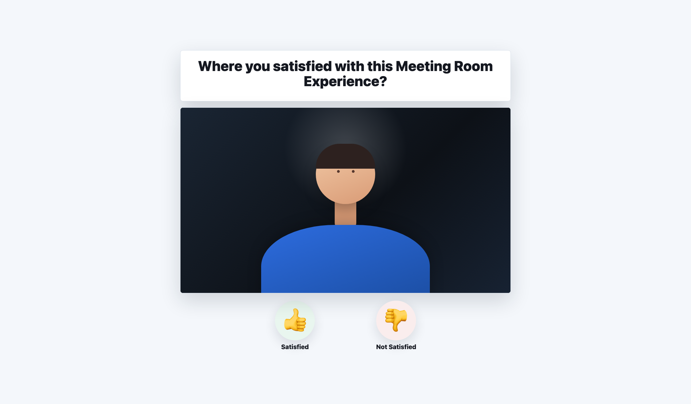
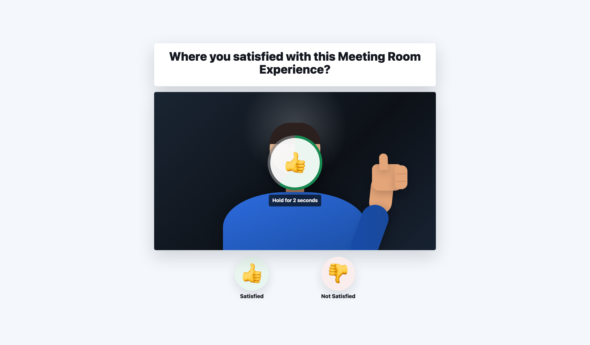
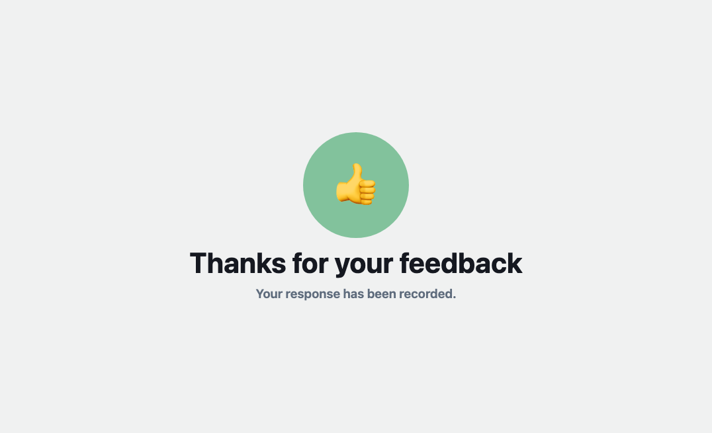
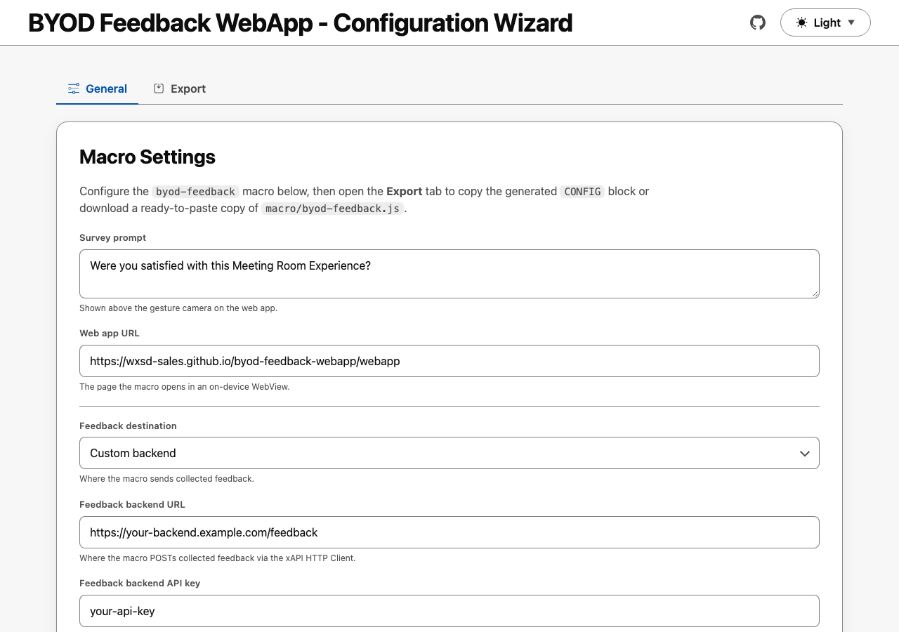

# BYOD Feedback Web App

This is an example web app that shows how to collect meeting room feedback from Cisco BYOD collaboration spaces where a Touch Controller isn't available by using thumbs up 👍 and down 👎 gestures.



## Overview

The solution consists of two parts:

### Post Meeting Macro:

The [byod-feedback](macro/byod-feedback.js) post meeting macro launches the feedback web app after a meeting or BYOD session disconnects, allowing users to give feedback directly from the room display. Once the web app has collected feedback from the user, it appends the feedback to the end of its URL where the macro can then process this feedback and send it to your desired backend via the xAPI HTTP Client xCommand.

Sequence: [Session Ends] -> [Web App Launched] -> [Feedback Collected] -> [Feedback Posted]

Example Feedback:

```json
{
  "device": {
    "workspaceName": "Meeting Room 1",
    "ipv4Address": "192.168.1.100",
    "ipv6Address": "",
    "deviceId": "1234567890"
  },
  "lastSession": {
    "type": "call",
    "details": {
      "meetingPlatform": "Unknown",
      "sessionType": "Call",
      "webexMeeting": "False"
    },
    "startTime": "2026-06-29T14:30:01.798Z",
    "endTime": "2026-06-29T14:33:01.798Z",
    "durationSeconds": 180,
    "durationMs": 180000
  },
  "feedback": {
    "feedback": "satisfied",
    "label": "Satisfied",
    "gesture": "Thumb_Up",
    "confidence": 0.7694,
    "heldForMs": 5000,
    "collectedAt": "2026-06-24T13:55:40.363Z"
  }
}
```

### Static Web App:

Upon opening, the web app accesses the Cisco Device's web camera and processes the video captured of the room through a [MediaPipe Gesture Recognizer](https://ai.google.dev/edge/mediapipe/solutions/vision/gesture_recognizer). No video capture leaves the device, and captured video is processed in the browser on the Cisco Device.

#### Hold Gesture Countdown:

When the user is detected as gesturing a thumbs up or thumbs down, a countdown is shown for a set time until the gesture is accepted. This hold time is controlled by `config.timers.gestureHoldSeconds` in the macro, which is passed to the web app as a `gestureHoldSeconds` URL hash parameter. The web app accepts any whole number of seconds from 1 to 30; values outside that range are clamped, and anything else unparsable falls back to 5 seconds.



#### Feedback Captured Success:

Once the feedback is captured, the web app then shows a success screen. In the background, the web app is updating its Url hash parameters with the collected feedback, where the macro will take this feedback and bundle it with the devices details and the last session details and POST them to your backend.



The live hosted web app is available here:

https://wxsd-sales.github.io/byod-feedback-webapp/webapp

### Configuration Wizard:

The [wizard](wizard/index.html) is a form-based alternative to hand-editing the macro: it's pre-filled with the macro's own default values, validates your input, can resolve a Webex space or person for you (see [Feedback Destinations](#feedback-destinations) below), and lets you download a ready-to-paste copy of the macro from your browser.

<a href="https://wxsd-sales.github.io/byod-feedback-webapp/wizard/">
  <picture>
    <source media="(prefers-color-scheme: dark)" srcset="screenshots/screenshot-wizard-dark.png">
    <source media="(prefers-color-scheme: light)" srcset="screenshots/screenshot-wizard-light.png">
    
  </picture>
</a>

The live hosted wizard is available here:

https://wxsd-sales.github.io/byod-feedback-webapp/wizard/

## Setup

### Prerequisites

- A Cisco RoomOS device with macro support enabled.
- Web engine support enabled on the device.
- Camera media access allowed for the hosted web app domain.
- Network access from the device to `https://wxsd-sales.github.io/byod-feedback-webapp/webapp`.

### Install The Macro

1. Open the device web interface.
2. Go to **Integration > Macro Editor**.
3. Create a new macro and paste in [macro/byod-feedback.js](macro/byod-feedback.js).
4. Confirm the macro configuration points to the hosted web app:

   ```js
   const config = {
     messagePrompt: "Were you satisfied with this Meeting Room Experience?",
     webAppUrl: "https://wxsd-sales.github.io/byod-feedback-webapp/webapp",
     feedback: {
       destination: "custom",
       url: "https://your-backend.example.com/feedback",
       apiKey: "your-api-key",
       webex: {
         botAccessToken: "your-bot-access-token",
         target: "room",
         roomId: "",
         toPersonEmail: "",
       },
     },
     timers: {
       autoCloseSeconds: 60,
       emptyRoomAutoCloseSeconds: 10,
       meetingDurationSeconds: 180,
       gestureHoldSeconds: 5,
     },
     debug: true,
   };
   ```

5. Save and enable the macro.

   Alternatively, use the [Configuration Wizard](wizard/index.html) to fill out these values in a form (pre-filled with the macro's own defaults, with invalid inputs blocked) and download a ready-to-paste copy of the macro.

> [!WARNING]
>
> The macro makes the following configuration changes to your device:
>
> - [xConfiguration WebEngine Mode: On](https://roomos.cisco.com/xapi/Configuration.WebEngine.Mode/)
>
>   Required to show the feedback web app
>
> - [xConfiguration HttpClient Mode: On](https://roomos.cisco.com/xapi/Configuration.HttpClient.Mode/)
>
>   Required for sending the collected feedback to your backend
>
> - [xCommand WebEngine MediaAccess Add Device: Camera Hostname: "wxsd-sales.github.io"](https://roomos.cisco.com/xapi/Command.WebEngine.MediaAccess.Add/)
>
>   Gives the web app domain access to the device's web cam

## Feedback Destinations

This macro leverages the xAPI HTTP Client xCommand to POST the collected feedback. This is as opposed to sending the collected feedback from the web app directly and potentially hitting CORS (Cross-Origin Resource Sharing) related blockers.

`feedback.destination` chooses where feedback goes:

- `"custom"` (default) - POSTs the device, session, and feedback details as JSON to `feedback.url`, authenticated with `feedback.apiKey` as a bearer token.
- `"webex"` - posts a formatted markdown summary to a Webex space or as a 1:1 message via the [Webex messages API](https://developer.webex.com/docs/api/v1/messages/create-a-message), using the bot access token and target configured under `feedback.webex`:
  - `botAccessToken` - an access token for a [Webex bot](https://developer.webex.com/docs/bots).
  - `target` - `"room"` to post to a space (`feedback.webex.roomId`), or `"person"` to send a direct message (`feedback.webex.toPersonEmail`).

Macro configuration example:

```js
const config = {
  messagePrompt: "Were you satisfied with this Meeting Room Experience?",
  webAppUrl: "https://wxsd-sales.github.io/byod-feedback-webapp/webapp",
  feedback: {
    destination: "custom",
    url: "https://your-backend.example.com/feedback",
    apiKey: "your-api-key",
    webex: {
      botAccessToken: "your-bot-access-token",
      target: "room",
      roomId: "",
      toPersonEmail: "",
    },
  },
  timers: {
    autoCloseSeconds: 60,
    emptyRoomAutoCloseSeconds: 10,
    meetingDurationSeconds: 180,
    gestureHoldSeconds: 5,
  },
  debug: true,
};
```

The [Configuration Wizard](wizard/index.html) can look up a space or person for you: paste in a bot access token and it searches Webex's List Rooms / List People APIs from your browser to resolve the `roomId` or `toPersonEmail` for you, alongside a preview of what the resulting message looks like.

## Hosting Your Own Copy

The web app is static HTML, CSS, and JavaScript, so it can be hosted from any HTTPS-capable web server.

1. Copy the `webapp` directory to your hosting environment.
2. Update `config.webAppUrl` in `macro/byod-feedback.js` to point to your hosted copy.
3. Ensure the RoomOS device can reach your web app URL and that the macro can add camera media access for that host.

## Demo

Video Demo: https://app.vidcast.io/share/5e644cf8-7d1d-4984-a149-02946d1725b3

Live Web App Demo: https://wxsd-sales.github.io/byod-feedback-webapp/webapp

_For more demos & PoCs like this, check out our [Webex Labs site](https://collabtoolbox.cisco.com/webex-labs)._

## License

All contents are licensed under the MIT license. Please see [license](LICENSE) for details.

## Disclaimer

Everything included is for demo and Proof of Concept purposes only. Use of the site is solely at your own risk. This site may contain links to third party content, which we do not warrant, endorse, or assume liability for. These demos are for Cisco Webex use cases, but are not official Cisco Webex branded demos.

## Questions

Please contact the WXSD team at [wxsd@external.cisco.com](mailto:wxsd@external.cisco.com?subject=byod-feedback-webapp) for questions. Or, if you're a Cisco internal employee, reach out to us on the Webex App via our bot (globalexpert@webex.bot). In the "Engagement Type" field, choose the "API/SDK Proof of Concept Integration Development" option to make sure you reach our team.
